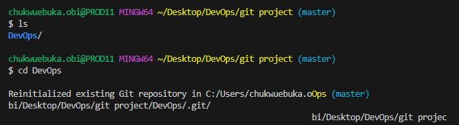

# Initializing a Repository and Making Commits

1. To initialize a git repository we run the git init but before then let us create our folder and
   move into it.

- To create a folder

```
mkdir
```

- To cd into this folder

```
cd DevOps
```

- To initialize git in this folder

```
git init
```



2. Making our first commit

- Inside our working directory, let us create a index.txt file

```
touch index.txt
```

- we will write some text into this file and save changes.

- Next we will stage our changes in git using the code below

```
git add .
```

- To commit out changes we do

```
git commit -m "our message"
```


3. Working on Branches

In git we can branch out of our main branch. If for example we have a new feature to add to our
project, or some changes to do or we are collaborating with other developers, we can create a branch
which is a sub from our main and work on that.

- To make a branch, we first create this branch by running the code

```
git checkout -b newOne
```


- To list all the branches we have we run

```
git branch
```


- To change into another branch we use

```
git checkout newOne
```


- To merge branches: Lets say the collaborating developer has finished working on his section
  (sidebar), and wants to merge with the main project we do something like below.

```
git merge newOne
```


4. Deleting a git branch

If the collaborating developer has finish working on his part and merge has taken place, we can go
ahead to delete the branch. To do this we run

```
git branch -d newOne
```


5. To can also collaborate with other developers with remote repositories. This can be done by
   creating a github account if you do not have one and pushing or pull code base from repositories.

- Pushing our local git repository to our remote github repository.

```
git remote add origin https://github.com/obiohaa/gitTests.git
```


- After adding remote origin, working on the code we can then push back to the repository.

```
git push master
```


- On most occasion, while collaborating, we would need to pull or clone git repositories to work
  with. To do this we

```
git clone https://github.com/obiohaa/gitTests.git
```


The README.md was done using MarkDown syntax.

THANK YOU.
